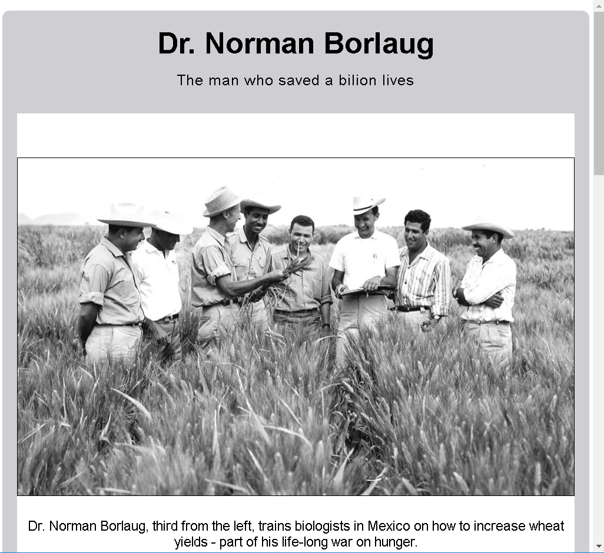

# fcc-tribute-page

## FreeCodeCamp certification project

Tribute page made on FreeCodeCamp about Dr. Norman Borlaug

## Preview

This was a very simple project to make, but I used for the first time `pseudo-elements` and `>` to select direct childs of elements, which I learned on some previous courses. It can really help when styling some elements.

My current goal is to master React, but first I need to complete some begginer courses on FreeCodeCamp
